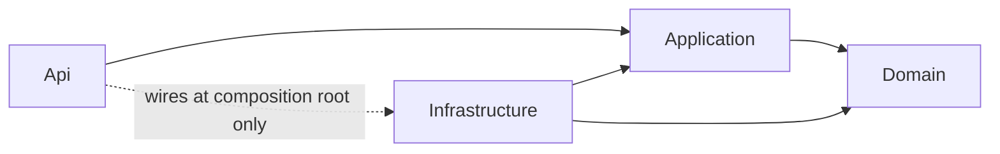
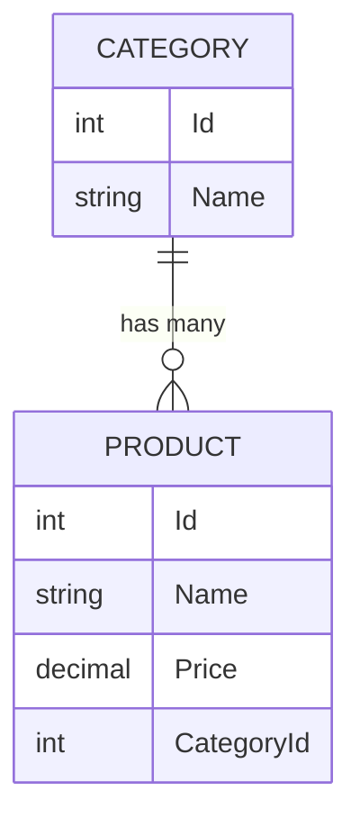

# Architecture Spine — ASP.NET Core Full-Stack Portfolio Project

## Design Paradigm

**Clean Architecture**, four projects, dependencies pointing inward toward Domain:



- **Domain** — entities (`Product`, `Category`), repository/unit-of-work interfaces. No dependency on anything else in the solution.
- **Application** — services (`ProductService`), DTOs, manual mappers, validation-adjacent logic. Depends only on Domain.
- **Infrastructure** — EF Core `DbContext`, repository/unit-of-work implementations, migrations. Implements Domain/Application interfaces.
- **Api** — controllers, middleware, auth, DI composition root (`Program.cs`). Depends on Application; wires Infrastructure only in `Program.cs`, never references it from a controller.

## Invariants & Rules

### AD-1 — Layered project boundaries

- **Binds:** all
- **Prevents:** a controller or service reaching past its layer (e.g. a controller calling `DbContext` directly, or Domain referencing Infrastructure)
- **Rule:** the four-project reference graph above is enforced by the compiler (project references), not just convention. `Domain` has zero project references. `Infrastructure` may not be referenced by `Api` except in `Program.cs`'s DI registration.

### AD-2 — Repository + Unit of Work

- **Binds:** FR-2, FR-7
- **Prevents:** Application/Api depending on EF Core or `DbContext` directly; untestable services
- **Rule:** `IProductRepository` and `IUnitOfWork` are defined in Domain (or Application), implemented in Infrastructure. `ProductService` depends only on the interfaces.

### AD-3 — DTO boundary

- **Binds:** FR-3
- **Prevents:** entity leakage through the API (over-posting, circular references, schema coupling)
- **Rule:** Domain entities never appear in a controller's request or response type. DTOs live in Application; controllers accept/return DTOs only.

### AD-4 — DI lifetimes

- **Binds:** FR-2, FR-9
- **Prevents:** captive-dependency bugs (a scoped service silently living as long as a singleton)
- **Rule:** `DbContext` and repositories are `Scoped`. Application services are `Scoped` by default; only framework-provided singletons (logging, `IConfiguration`) are `Singleton`. **Exception, scoped and documented:** FR-2/FR-9 require reproducing a scoped-into-singleton violation exactly once, observing the failure, then fixing it — that reproduction is the deliberate input to the FR-9 postmortem, not a standing exception to this rule.

### AD-5 — Token storage

- **Binds:** FR-4, FR-5
- **Prevents:** XSS-based token theft (the localStorage failure mode)
- **Rule:** the login endpoint issues the JWT as an `httpOnly`, `Secure`, `SameSite` cookie. React never reads or stores the raw token. Mutating requests (`POST`/`PUT`/`DELETE`) carry a CSRF/anti-forgery token, validated server-side.

### AD-6 — Correlation ID

- **Binds:** FR-1 (NFR), FR-9
- **Prevents:** a postmortem timeline that can't actually be reconstructed from logs
- **Rule:** middleware assigns a correlation ID per request (`X-Correlation-Id`, generated if absent) and attaches it to the `ILogger` scope for that request's lifetime.

### AD-7 — Frontend resilience

- **Binds:** FR-5
- **Prevents:** retrying a client error (4xx) as if it were transient, and unbounded retry loops
- **Rule:** the API-calling layer retries with exponential backoff (max 3 attempts) only on network failure or 5xx responses. 4xx responses are never retried.

### AD-8 — Validation strategy `[ASSUMPTION]`

- **Binds:** FR-3
- **Prevents:** two DTOs validated by different mechanisms (Data Annotations on one, FluentValidation on another)
- **Rule:** Data Annotations on DTOs, enforced automatically by `[ApiController]`'s model-state validation (400 + `ProblemDetails` on failure). No FluentValidation dependency for this scope.

### AD-9 — Mapping strategy `[ASSUMPTION]`

- **Binds:** FR-3, FR-7
- **Prevents:** inconsistent or hidden-at-runtime entity↔DTO mapping bugs
- **Rule:** mapping is manual, via extension methods (`ToDto()` / `ToEntity()`) in Application. No AutoMapper dependency — this becomes PRD ADR-002's documented decision.

### AD-10 — Category deletion behavior `[ASSUMPTION]`

- **Binds:** FR-1
- **Prevents:** silent data loss from an unconsidered cascade delete
- **Rule:** deleting a `Category` that still has `Product` rows returns `409 Conflict`; no cascade delete.

## Consistency Conventions

| Concern | Convention |
| --- | --- |
| Naming (entities, files, interfaces, events) | PascalCase for C# types/namespaces/interfaces (`IProductRepository`); lowercase-plural kebab API routes (`/api/products`); PascalCase React components; camelCase TS variables/props |
| Data & formats (ids, dates, error shapes, envelopes) | `[ASSUMPTION]` int identity primary keys (not GUID); dates stored/serialized as UTC ISO 8601 (`System.Text.Json` default); all 4xx/5xx responses use RFC 7807 `ProblemDetails` |
| State & cross-cutting (mutation, errors, logging, config, auth) | Mutation only through Application services, never repository calls from controllers; unhandled exceptions caught by global middleware and rendered as `ProblemDetails`; logging via `ILogger<T>` + AD-6 correlation ID; config via `appsettings.json` + `IOptions<T>`; auth via `[Authorize]` + AD-5's cookie flow |

## Stack

*Verified current as of 2026-08-18 — seed only, the code owns exact versions once scaffolded.*

| Name | Version |
| --- | --- |
| .NET / ASP.NET Core | 10 (LTS, supported to Nov 2028) |
| EF Core | 10.x (tracks .NET major) |
| Database | SQL Server (LocalDB or Developer edition for local dev) |
| React | 19.x (current major; latest patch ~19.2.8) |
| Frontend build tool | Vite (React + TypeScript template — current paved path; Create React App is deprecated) |
| Testing | xUnit + Moq — pin latest stable at scaffold time, not pinned here |

## Structural Seed

```text
ASPFullStackBMAD/
  src/
    Api/                    # controllers, middleware, Program.cs (composition root)
    Application/            # services, DTOs, manual mappers
    Domain/                 # entities, repository/UoW interfaces
    Infrastructure/         # DbContext, repository/UoW implementations, migrations
  tests/
    Application.Tests/      # xUnit + Moq, mocks IProductRepository
  client/
    src/
      components/           # React components
      api/                  # fetch/axios wrapper, retry logic (AD-7)
  docs/
    adr/                    # ADR-001..N (FR-7)
```



## Deferred

- **Deployment & environments** — explicitly out of scope per PRD §6.2 (no live/hosted deployment required for v1). Local dev only: `dotnet run` + Vite dev server against LocalDB/SQL Server Developer edition. No CI/CD pipeline in scope.
- **Exact xUnit/Moq/EF Core patch versions** — pin at scaffold time (`dotnet new` / `dotnet add package`) rather than here, since they move faster than this spine.
- **Angular track** — parked per PRD §6.2 as a possible v2 if the job search targets an Angular-specific role; would need its own spine slice, not a retrofit of this one.
- **Multi-tenant / roadmap horizons** — FR-10 (EM-track roadmap) is a narrative artifact about *future* direction, not a build requirement of this spine.
